<div align="center">

# ⛓️ TrustChain

### Multi-Agent AI with Every Step Permanently Recorded On-Chain


<br/>

[](https://nextjs.org/)
[](https://fastapi.tiangolo.com/)
[](https://langchain-ai.github.io/langgraph/)
[](https://soliditylang.org/)
[](https://monad.xyz/)

<br/>

[](https://github.com/nipunkalsotra/TrustChain/stargazers)
[](https://github.com/nipunkalsotra/TrustChain/forks)
[](LICENSE)

</div>

<br/>

> **TrustChain answers a simple question: how do you *prove* an AI agent did what it says it did?**
> Every decision, every tool call, every handoff between agents is written as a transaction on the Monad blockchain — permanently, publicly, and tamper-proof. A judge (or a user) opens the app, types a task, and watches 4 agents work in real time, with a clickable on-chain receipt for every single step.

<br/>

---

## 🧠 The Problem

AI agents are increasingly trusted to act autonomously — but their internal reasoning is a black box. If an agent makes a decision, **there's no way to independently verify** it wasn't tampered with, hallucinated, or silently altered after the fact.

**TrustChain solves this by treating the blockchain as an immutable audit log for AI cognition itself.**

<br/>

## ⚙️ How It Works

```mermaid
flowchart LR
    A["👤 User submits task"] --> B["🧩 LangGraph<br/>4-Agent Pipeline"]
    B --> C1["Agent 1<br/>Planner"]
    C1 --> C2["Agent 2<br/>Researcher"]
    C2 --> C3["Agent 3<br/>Synthesizer"]
    C3 --> C4["Agent 4<br/>Verifier"]
    C4 --> D["⛓️ web3.py Bridge"]
    D --> E["📜 Solidity Contracts<br/>on Monad Testnet"]
    E --> F["🔗 Tx Hash Returned"]
    F --> G["💻 Next.js UI<br/>Live SSE Feed"]

    style A fill:#1e2327,stroke:#00D9FF,color:#fff
    style B fill:#1e2327,stroke:#836EF9,color:#fff
    style E fill:#1e2327,stroke:#836EF9,color:#fff
    style G fill:#1e2327,stroke:#00D9FF,color:#fff
```



Every arrow above isn't just a function call — it's a **logged, verifiable event.** Click any step in the live feed and jump straight to its transaction on the Monad explorer.

<br/>

## 🏗️ Architecture

<table>
<tr>
<td width="33%" valign="top">

### 🖥️ Frontend
- **Next.js 14** (App Router)
- **shadcn/ui** components
- **Recharts** for live metrics
- **Server-Sent Events (SSE)** for real-time agent streaming — no polling, no refresh

</td>
<td width="33%" valign="top">

### 🤖 Backend
- **FastAPI** async server
- **LangGraph** 4-agent state machine pipeline
- **Groq** for low-latency LLM inference
- **Tavily** for live web search/grounding

</td>
<td width="33%" valign="top">

### ⛓️ Blockchain
- **3 Solidity contracts** deployed on Monad Testnet
- **web3.py** bridge between Python backend and chain
- Every agent action → 1 on-chain transaction

</td>
</tr>
</table>

<br/>

## 📜 Smart Contracts (Monad Testnet)

| Contract | Purpose | Address |
|---|---|---|
| 🪪 `AgentIdentityRegistry` | Registers each agent's unique on-chain identity | `0x68f7fd16e99b640cb7b9a957ac12b4f13fa792ed` |
| 📝 `AgentAuditLog` | Immutably logs every step/decision an agent takes | `0xcf15079dbf148205516aee935c3cc5cdd4ceb4b9` |
| ⭐ `TrustScoreRegistry` | Tracks reliability score per agent over time | `0xc0e3ab853587e0bb039249ef47aade7b055c58fd` |

<br/>

## 🔥 Why This Matters

<table>
<tr><td>🔍</td><td><b>Verifiable AI</b> — anyone can independently audit what an agent actually did, with no need to trust the developer's word.</td></tr>
<tr><td>⚡</td><td><b>Real-time transparency</b> — the live SSE feed means you watch the multi-agent pipeline think, not just see a final answer.</td></tr>
<tr><td>🛡️</td><td><b>Tamper-evidence by design</b> — once written to Monad, a step's record cannot be silently edited or deleted.</td></tr>
<tr><td>🧩</td><td><b>Composable agent identity</b> — each agent has its own on-chain identity and trust score, enabling reputation systems for multi-agent ecosystems.</td></tr>
</table>

<br/>

## 🚀 Quick Start

```bash
# Clone
git clone https://github.com/nipunkalsotra/TrustChain.git
cd TrustChain

# Backend
cd backend
cp .env.example .env   # add your GROQ_API_KEY, TAVILY_API_KEY, RPC_URL, PRIVATE_KEY
pip install -r requirements.txt
uvicorn main:app --reload --port 8000

# Frontend (new terminal)
cd frontend
npm install
npm run dev
```

Open `http://localhost:3000`, type a task, and watch the agents go to work — with every step landing on-chain in real time.

<br/>

## 📁 Repo Structure

```
TrustChain/
├── contracts/        # Solidity + Foundry deployment scripts
├── backend/          # FastAPI + LangGraph agent pipeline + web3.py bridge
├── frontend/          # Next.js 14 app with live SSE agent feed
├── mcp_servers/        # MCP tool servers used by the agent pipeline
└── start.sh           # One-command local startup
```

<br/>

## 🛣️ Roadmap

- [x] 4-agent LangGraph pipeline with on-chain logging
- [x] Live SSE streaming to frontend
- [x] Trust score registry per agent
- [ ] Mainnet deployment
- [ ] Multi-chain support (beyond Monad)
- [ ] Public agent leaderboard

<br/>

---

<div align="center">

### Built by [Nipun Kalsotra](https://github.com/nipunkalsotra)


⭐ **Star this repo if you believe AI agents should be accountable.**

</div>
