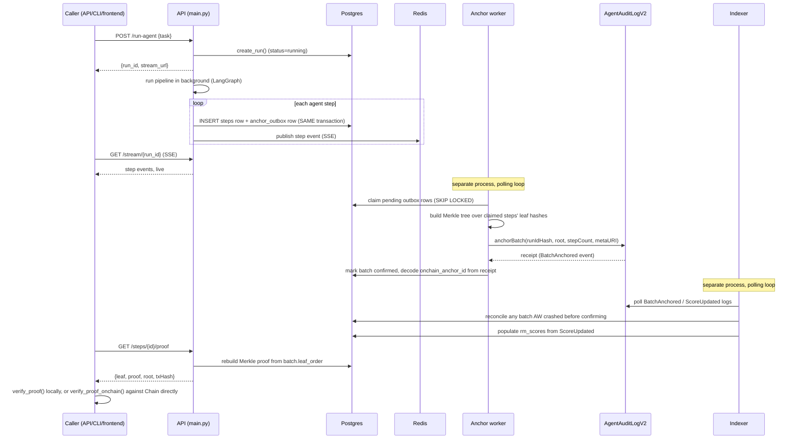

# Architecture

TrustChain runs a 4-agent LangGraph pipeline (researcher → validator →
scorer → reporter) and anchors a cryptographic proof of every step it
takes — inputs, outputs, and scores — on Monad, so a run's audit trail
can be verified independently of TrustChain's own database ever being
trusted. This document is the map: what each piece does, how a request
actually flows through the system end to end, and the invariants that
have to hold for any of that to mean something. Individual design
decisions and their tradeoffs live in [`docs/adr/`](adr/) — this
document is deliberately the "what and how", ADRs are the "why, and
what else we considered".

## System components

| Component | Path | Responsibility |
|---|---|---|
| **API** | `backend/main.py` | FastAPI app — auth, run orchestration, read endpoints, the third-party self-instrumentation surface (`POST /agents`, `POST /steps`, ...) |
| **Anchor worker** | `backend/anchor_worker/` | Claims pending steps from the outbox, batches them into Merkle trees, submits `anchorBatch()` on-chain |
| **Indexer** | `backend/indexer/` | Polls `BatchAnchored`/`ScoreUpdated` events, populates the read model (`rm_scores`), reconciles the anchor worker's crash window |
| **MCP servers** | `mcp_servers/{web_search,blockchain}/` | Tool servers the pipeline's agents call over MCP — search grounding for the researcher, on-chain reads for the scorer |
| **Contracts (V1)** | `contracts/src/*.sol` | Original single-tenant contracts — kept read-only for `/verify`/`/verify/tamper-demo`'s live on-chain demo, no longer written to |
| **Contracts (V2)** | `contracts/src/v2/*.sol` | `AgentAuditLogV2` (Merkle-batch anchoring), `TrustScoreRegistryV2`, `AgentIdentityRegistryV2`, `TrustChainRegistry` (version→deployment resolution) |
| **Postgres** | — | System of record for runs/steps/outbox/anchor batches/tenancy — see [Data model](#data-model) |
| **Redis** | — | SSE event bus (multi-replica-safe run streaming), rate limiting, idempotency-key locking |
| **Anvil / Monad testnet** | — | Local dev chain (Anvil) or the real target (Monad testnet) — see [ADR-0009](adr/0009-rpc-fallback-and-circuit-breaker.md) for how the RPC connection to either is made resilient |
| **Python SDK** (`trustchain-sdk`) | `sdk/python/` | `TrustChain` — instrument a third-party agent directly (`register_agent`, `log`, `verify_proof`); `TrustChainClient` — REST wrapper around TrustChain's own pipeline |
| **TypeScript SDK** (`trustchain-sdk`) | `sdk/typescript/` | Same two-surface design, mirrored — see [ADR-0007](adr/0007-sdk-instrumentation-library-not-just-a-wrapper.md) |
| **CLI** (`trustchain-cli`) | `sdk/python-cli/` | `trustchain verify <run-id>`, `trustchain agents ...`, `trustchain keys ...`, local dev-stack helpers |
| **Frontend** | `frontend/` | Next.js UI — run the pipeline, watch it stream live, browse the leaderboard/audit log |

## Request lifecycle: a pipeline run, start to finish

The step that makes this durable rather than best-effort: **the
`anchor_outbox` row is written in the *same* Postgres transaction as the
`steps` row it refers to** (`agents/base.py::log_step`). A crash between
"recorded the step" and "told the chain about it" is unobservable from
outside — either both rows commit, or neither does. See
[ADR-0001](adr/0001-transactional-outbox-for-anchoring.md).

## Data model

Tables that matter for the architecture (full schema: `backend/db/models.py`,
migration history: `backend/alembic/versions/`):

- **`runs`** / **`steps`** — one row per pipeline run / per agent action.
  `steps.leaf_hash` is what actually gets anchored (via a batch's Merkle
  root); `input_hash`/`output_hash` let a verifier confirm a specific
  input/output pair without TrustChain's database being trusted for
  content, only for the hash-to-content mapping.
- **`anchor_outbox`** — durable intent to anchor a step (`pending` →
  `claimed` → `anchored` | `dead_letter`). See ADR-0001.
- **`anchor_batches`** — one row per Merkle-batch submission
  (`building` → `submitted` → `confirmed` | `failed`).
  `leaf_order` (the exact, ordered step-id list used to build the tree)
  is persisted rather than re-derived, so a proof can always be
  reconstructed exactly, regardless of what the `steps` table looks like
  later. See [ADR-0002](adr/0002-merkle-batching-not-per-step-anchoring.md).
- **`rm_scores`** — pure read model, a function of `ScoreUpdated` events
  (invariant I6: "always rebuildable from genesis" — see
  `db/models.py`'s `ReadModelScore` docstring). Never a write target for
  anything except the indexer.
- **`organizations`** / **`projects`** / **`memberships`** / **`api_keys`**
  — multi-tenancy. Every tenant-scoped table (`runs`, `steps` via its
  parent run, `idempotency_keys`, `audit_events`) carries or resolves to
  a `project_id`, and invariant **I7** ("no tenant can read or write
  another tenant's runs, agents, or scores") is enforced at TWO
  independent layers — application-level `WHERE project_id = ...`
  filtering AND Postgres Row-Level Security under a separate,
  non-superuser `trustchain_api` role (see
  [ADR-0006](adr/0006-row-level-security-as-defense-in-depth.md)) — so a
  single missed filter in a future endpoint doesn't silently become a
  cross-tenant data leak.

## Security model

- **Auth**: session JWT (human/frontend, 7-day, `iss`/`aud` validated —
  [ADR-0010](adr/0010-jwt-issuer-and-audience-claims.md)) or API key
  (`tc_live_.../tc_test_...`, scoped, machine/SDK) — both accepted
  interchangeably by `auth.get_current_principal` wherever an endpoint
  serves both humans and third-party integrations.
- **Passwords**: Argon2id (memory-hard), with transparent, on-login
  migration from the original PBKDF2-HMAC-SHA256 hashes — no forced
  reset, no separate backfill script (`db/__init__.py`).
- **Tenant isolation**: invariant I7, enforced at both the application
  layer and via Postgres RLS (see above).
- **Signing key custody**: pluggable `Signer` protocol
  (`blockchain/signer.py`) — `LocalKeySigner` (dev), `AwsKmsSigner` /
  `GcpKmsSigner` (the raw key never leaves the cloud KMS), `VaultKvSigner`
  (HashiCorp Vault KV v2 — centrally managed custody, not the same
  never-exposed guarantee as the KMS backends, see that class's
  docstring for the honest distinction). See
  [ADR-0008](adr/0008-pluggable-signer-backends.md).
- **Admin authority**: `DEFAULT_ADMIN_ROLE` (rare, ideally a multisig —
  see `docs/multisig-admin-handoff.md`) is separate from `ANCHOR_ROLE`
  (routine batch anchoring) and `REGISTRAR_ROLE` (routine agent
  registration) on the V2 contracts — a compromised hot key never gains
  admin power, and routine multi-tenant operations never need a
  multisig ceremony.

## Blockchain layer

TrustChain has two contract generations live simultaneously, by design,
not by half-finished migration — see
[ADR-0003](adr/0003-v1-to-v2-contract-migration-strategy.md):

- **V1** (`AgentAuditLog`, `AgentIdentityRegistry`, `TrustScoreRegistry`)
  — single-tenant, per-action anchoring. Kept **read-only**, serving
  `/verify` and `/verify/tamper-demo`'s live on-chain proof demo, on
  whichever chain it was originally deployed to (real Monad testnet).
- **V2** (`AgentAuditLogV2`, `TrustScoreRegistryV2`,
  `AgentIdentityRegistryV2`, `TrustChainRegistry`) — multi-tenant,
  Merkle-batched anchoring, role-separated admin/anchor/registrar
  authority. All new writes go here.

RPC connections (both V1's `BlockchainBridge` and V2's anchor
worker/indexer) go through `blockchain/resilient_provider.py`'s
`FallbackHTTPProvider` — a per-endpoint circuit breaker plus automatic
failover to a configured backup RPC URL, so a transient RPC outage
doesn't take down anchoring, scoring, or health checks with no recovery
path but a process restart. See
[ADR-0009](adr/0009-rpc-fallback-and-circuit-breaker.md).

## Deployment topology

A single docker-compose host (`docker-compose.yml`) runs every service —
`postgres`, `redis`, `anvil` (local dev only), `api`, `anchor-worker`,
`indexer`, the two MCP servers, `prometheus`, `grafana`. There is no real
staging/production cloud target configured yet (see
`docs/release-process.md`'s "Honest limitation" section) — deploys are a
canary-rollout-then-bake-or-rollback script
(`deploy/canary_rollout.sh`, [ADR-0011](adr/0011-canary-rollout-for-a-single-host-deploy.md))
run over SSH against that same docker-compose model, not a fleet behind
a load balancer.

## Observability

Prometheus metrics (`backend/observability.py`) cover HTTP request
rate/latency, pipeline run outcomes, anchor batch submit/failure/backlog,
indexer lag/reconciliations, the anchor wallet's live balance, and each
configured RPC endpoint's circuit-breaker state. Alert rules and their
paired runbook entries live in `docker/prometheus/alerts.yml` /
`docs/runbooks.md` — every alert's `runbook` annotation links to the
matching runbooks.md section.

## CI/CD

`.github/workflows/test.yml` runs, per push/PR: Foundry build/test/
gas-snapshot-check/coverage-gate/Slither (contracts), pytest/ruff/
mypy/Bandit/pip-audit/anchor-payload-PII-check (backend), tsc/lint/build/npm-audit (frontend),
gitleaks (secret scanning, blocking — the same check also runs locally
as a pre-commit hook via `.pre-commit-config.yaml`, `pre-commit install`
opts a clone into it), an API compatibility check
diffing the current OpenAPI schema against the previous release's for
breaking changes (`api-compat-check`, see
[`docs/api-deprecation-policy.md`](api-deprecation-policy.md)), and a
full docker-compose integration pass exercising both SDKs against a
live stack plus Schemathesis API fuzzing, Trivy image scanning, and
SBOM generation.
`.github/dependabot.yml` covers every pip/npm/docker/github-actions
ecosystem in the repo. See the workflow file itself for what's blocking
vs. informational, and why (several gates were introduced against a
codebase that predates them, and are deliberately non-blocking until a
dedicated cleanup pass — see individual step comments in that file).

## Further reading

- [`docs/adr/`](adr/) — why these decisions, and what else was considered
- [`docs/release-process.md`](release-process.md) — how a release/deploy actually happens
- [`docs/runbooks.md`](runbooks.md) — what to do when an alert fires
- [`docs/slo.md`](slo.md) — what's actually measured, the objectives behind each alert threshold, and the error-budget policy tying them together
- [`docs/api-deprecation-policy.md`](api-deprecation-policy.md) — how a route gets deprecated, the `Deprecation`/`Sunset` headers that announce it, and notice-period commitment
- [`docs/threat-model.md`](threat-model.md) — assets, actors, threats and their mitigations (or honestly-flagged gaps)
- [`docs/deployment-modes.md`](deployment-modes.md) — self-hosted (what exists) vs. hosted (a design sketch, not built)
- [`docs/multisig-admin-handoff.md`](multisig-admin-handoff.md) — the V2 admin-role migration to a Safe
